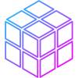
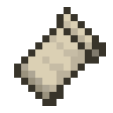
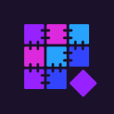
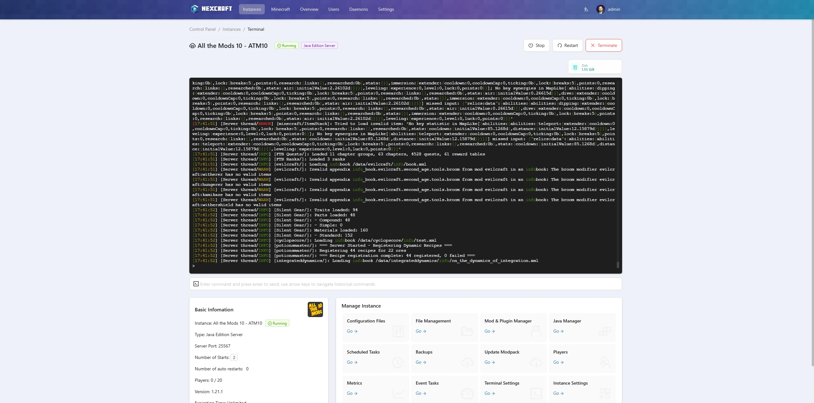
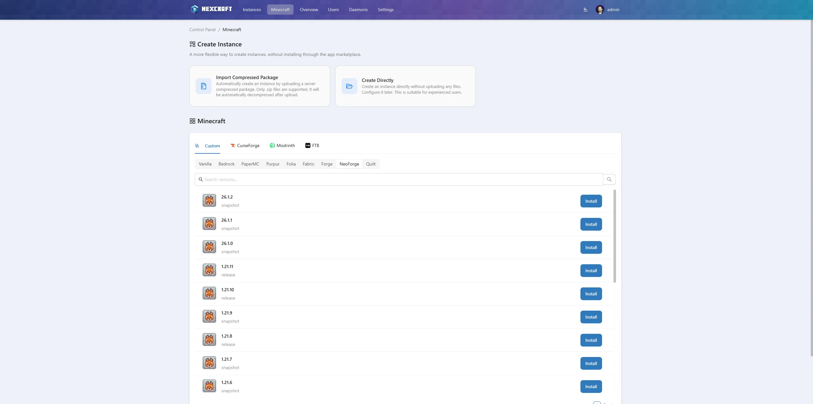
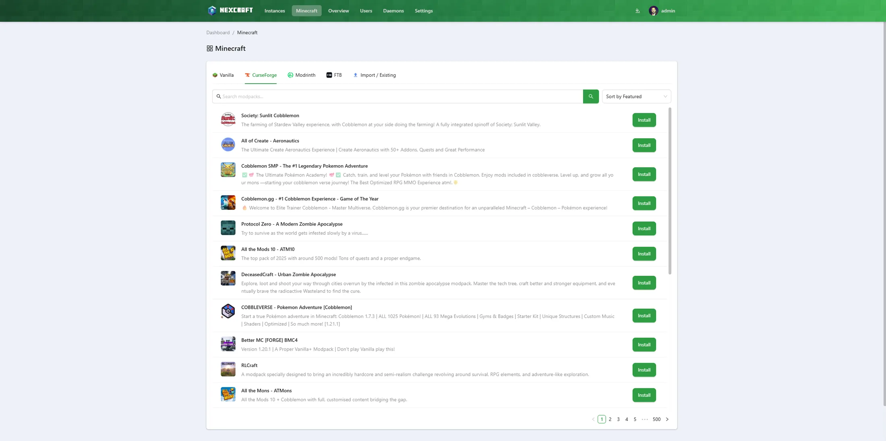
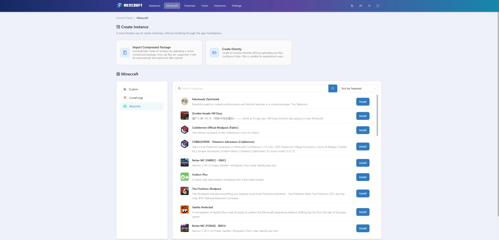
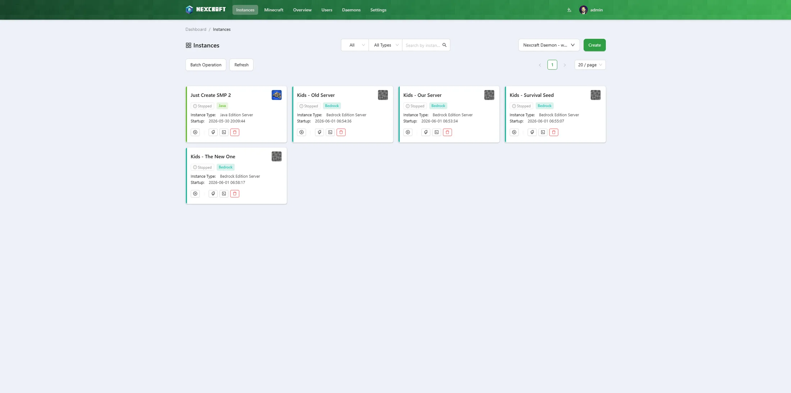
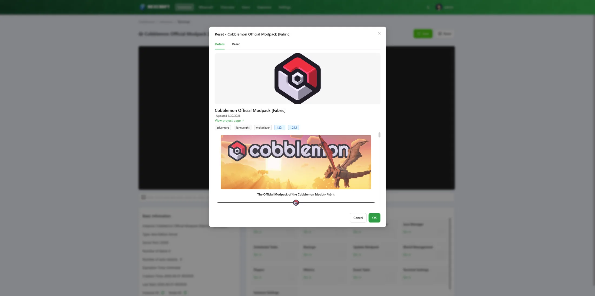

<div align="center">
  

  <h1>NexCraft</h1>

  <p><strong>A Minecraft-focused server control panel with a built-in modpack installer &amp; manager.</strong></p>

[](#)
[](https://nodejs.org/en/download/)
[](https://www.apache.org/licenses/LICENSE-2.0)

  <sub>Built on <a href="https://github.com/MCSManager/MCSManager">MCSManager</a> — see <a href="#credits">Credits</a>.</sub>

  <br />
  <br />

  <p><strong>Sources</strong></p>
  <p>
    
    &nbsp;&nbsp;&nbsp;
    
  </p>

  <p><strong>Loaders &amp; server software</strong></p>
  <p>
    
    &nbsp;
    
    &nbsp;
    
    &nbsp;
    
    &nbsp;
    
    &nbsp;
    
    &nbsp;
    
    &nbsp;
    
  </p>

</div>

<br />

<div align="center">
  
  <br />
  <sub><em>The instance console — a live modpack install in progress, alongside Basic Info and the Manage Instance grid.</em></sub>
</div>

<br />

## What is this?

**NexCraft** is a self-hosted, web-based control panel for running **Minecraft** servers. It started as a personal fork of [MCSManager](https://github.com/MCSManager/MCSManager) and has been reshaped around a single goal: **make standing up, updating, and maintaining Minecraft servers effortless.**

The headline feature is a **Prism-Launcher-style modpack browser** built directly into the panel. Search **CurseForge** and **Modrinth**, or build a **custom** server (Vanilla / Paper / Purpur / Folia / Fabric / Forge / NeoForge / Quilt) against accurate, live version lists — then install it as a running server in one click. Once installed, an instance can be **updated to a newer pack version** (with an automatic safety backup that preserves your world) or **reset/reinstalled** entirely, all from the same builder.

Everything is wrapped in the proven MCSManager foundation: a distributed multi-node, multi-user architecture with a drag-and-drop dashboard, real-time terminals, file management, and granular permissions.

<br />

## Features

**Modpack & server builder**
- **Modpack browser** — CurseForge / Modrinth / Custom, with real project search, version pickers, and one-click install as a server.
- **Custom builder** — Vanilla, **Paper**, **Purpur**, **Folia**, Fabric, Forge, NeoForge, Quilt, using official APIs for accurate version lists.
- **Per-instance Update card** — bump an installed modpack to a newer version; the panel auto-backs up and preserves your world, configs, ops/whitelist and icon.
- **Reset / Reinstall** — rebuild an instance from the same builder, with a choice of *auto-backup then wipe*, *full wipe*, or *preserve world & replace the rest*.

**Minecraft conveniences**
- **Auto-Java** — provisions a matching JRE (Adoptium / Azul Zulu, with release dates) per pack; no more `UnsupportedClassVersionError`.
- **Backups** — manual and scheduled, with restore, exclusions, and pre/post commands.
- **Players** — RCON-based online list with op / deop / kick / ban.
- **Metrics** — per-instance CPU / RAM (measured across the process tree) and player count, with zoom and selectable time ranges.
- **Easy MOTD editor**, **server icon** upload, **autostart delay**, and **shutdown timeout** — all in instance settings.
- Accurate **"Starting" → "Running"** status (waits for the server to actually be up).

**Platform (from MCSManager)**
- Distributed architecture — manage multiple machines from one panel.
- Multi-user with a granular permission system.
- Customizable, drag-and-drop card dashboard.
- Runs on Windows, Linux, and macOS. TypeScript end to end.

<br />

## Screenshots

<table>
  <tr>
    <td width="50%" align="center">
      <br />
      <sub><em>Custom builder — pick a loader and an accurate Minecraft version.</em></sub>
    </td>
    <td width="50%" align="center">
      <br />
      <sub><em>CurseForge modpack browser.</em></sub>
    </td>
  </tr>
  <tr>
    <td width="50%" align="center">
      <br />
      <sub><em>Modrinth modpack browser.</em></sub>
    </td>
    <td width="50%" align="center">
      <br />
      <sub><em>Instances list with live status.</em></sub>
    </td>
  </tr>
  <tr>
    <td width="50%" align="center">
      <br />
      <sub><em>Reset / Reinstall — choose backup-then-wipe, full wipe, or preserve world.</em></sub>
    </td>
    <td width="50%" align="center">
      <br />
      <sub><em>Backups — manual &amp; scheduled, with restore and exclusions.</em></sub>
    </td>
  </tr>
</table>

<br />

## Documentation

📖 **Read the docs site: [dpavlakis.github.io/NexCraft](https://dpavlakis.github.io/NexCraft/)**

The same content lives in **[`docs/`](docs/)** as Markdown:

- [Installation](docs/installation.md)
- [Creating Minecraft Servers](docs/creating-servers.md)
- [Updating & Resetting Modpacks](docs/modpacks.md)
- [Managing an Instance](docs/managing-instances.md)
- [Troubleshooting / FAQ](docs/faq.md)

<br />

## Runtime Environment

NexCraft runs on **Windows** and **Linux** (and macOS). No database is required — just the **Node.js** runtime (latest LTS recommended) and basic decompression utilities. The daemon ships with Java 21 and provisions additional JRE versions on demand for packs that need them.

<br />

## Installation

NexCraft is a personal fork and is built and deployed from source (Docker is the typical path). The underlying installation mechanics are inherited from MCSManager — see the [MCSManager documentation](https://docs.mcsmanager.com/) for the base install/runtime details, then build the NexCraft `web` and `daemon` images from this repository.

A high-level Docker build looks like:

```bash
# Daemon image (daemon/ + common/)
docker build -f dockerfile/daemon.dockerfile -t nexcraft-daemon .

# Web image (frontend/ + panel/ + languages/ — also compiles the daemon)
docker build -f dockerfile/web.dockerfile -t nexcraft-web .
```

Run the two containers (web on `23333`, daemon on `24444`), mounting persistent `data/` and `logs/` volumes for each, then open the panel and connect the daemon node.

<br />

## Development

The project comprises three core modules:

- **Daemon backend** (`daemon/`) — process management, file system, real-time terminals, modpack/loader install tasks.
- **Web backend** (`panel/`) — users, node connectivity, auth, API services.
- **Web frontend** (`frontend/`) — Vue 3 + Ant Design Vue UI.

See [DEVELOPMENT.md](./DEVELOPMENT.md) for environment setup, and [CLAUDE.md](./CLAUDE.md) for the NexCraft-specific architecture notes and build workflow.

<br />

## Browser Compatibility

All major modern browsers (`Chrome`, `Firefox`, `Safari`, `Opera`, Edge/Brave). Internet Explorer is not supported.

<br />

## Credits

NexCraft is built on **[MCSManager](https://github.com/MCSManager/MCSManager)** by the MCSManager team and contributors — a fast, distributed, multi-user management panel for Minecraft and Steam game servers. Huge thanks to them for the foundation this project stands on. The original panel is credited in-app (login footer).

If you want a general-purpose, commercially-oriented game-server panel (including Steam games and IDC/hosting use cases), use upstream MCSManager directly:

- Website: https://mcsmanager.com/
- Docs: https://docs.mcsmanager.com/
- Repo: https://github.com/MCSManager/MCSManager

### Contributors (MCSManager)

<a href="https://openomy.com/MCSManager/MCSManager" target="_blank" style="display: block; width: 100%;" align="center">
  
</a>

<br />

## License

This project is licensed under the [Apache License 2.0](https://www.apache.org/licenses/LICENSE-2.0), the same license as upstream MCSManager.

&copy; MCSManager team (original work) and NexCraft contributors.
