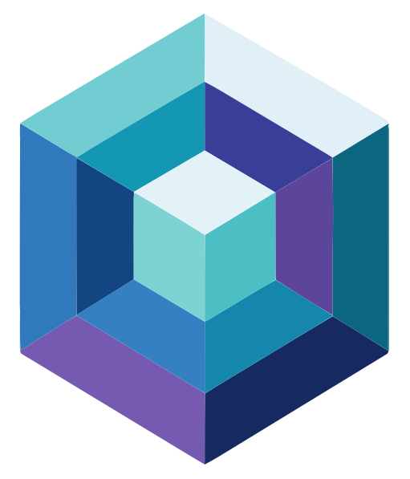

  
  <h1>NexCraft Documentation</h1>
  
<em>A Minecraft-focused server control panel with a built-in modpack installer &amp; manager.</em>

Welcome to the NexCraft docs. NexCraft is a self-hosted web panel for running **Minecraft** servers — search and install modpacks from **CurseForge** and **Modrinth**, build custom servers (Vanilla / Paper / Purpur / Folia / Fabric / Forge / NeoForge / Quilt), and manage everything from one dashboard.

> NexCraft is built on the open-source [MCSManager](https://github.com/MCSManager/MCSManager) panel. For a general-purpose, multi-game/commercial panel, see upstream MCSManager and its docs at https://docs.mcsmanager.com/.

## Contents

- **[Installation](installation.md)** — run the panel and connect a node.
- **[Creating Minecraft Servers](creating-servers.md)** — the Minecraft builder and modpack browser.
- **[Updating & Resetting Modpacks](modpacks.md)** — update a pack version or reinstall an instance.
- **[Managing an Instance](managing-instances.md)** — settings, MOTD, backups, players, metrics, Java.
- **[Troubleshooting / FAQ](faq.md)** — common issues and fixes.

## At a glance

| Area | What you get |
| --- | --- |
| **Modpack browser** | CurseForge / Modrinth / Custom, live search + version pickers, one-click install as a server |
| **Loaders** | Vanilla, Paper, Purpur, Folia, Fabric, Forge, NeoForge, Quilt — accurate versions from official APIs |
| **Update** | Bump an installed pack to a newer version; auto-backup, world preserved |
| **Reset / Reinstall** | Rebuild an instance with a choice of *auto-backup then wipe*, *full wipe*, or *preserve world* |
| **Java** | Auto-provisions a matching JRE (Adoptium / Azul Zulu) per pack |
| **Backups** | Manual + scheduled, with restore and exclusions |
| **Players** | RCON online list with op / kick / ban |
| **Metrics** | Per-instance CPU / RAM / players with zoom |
| **Convenience** | MOTD editor, server icon, autostart delay, shutdown timeout |

> **Note on Docker:** NexCraft runs servers in **host / general process mode** only — running game servers *inside* Docker containers (an MCSManager feature) has been removed from the UI to keep things simple and Minecraft-focused. The panel *itself* is typically deployed via Docker (see [Installation](installation.md)).
