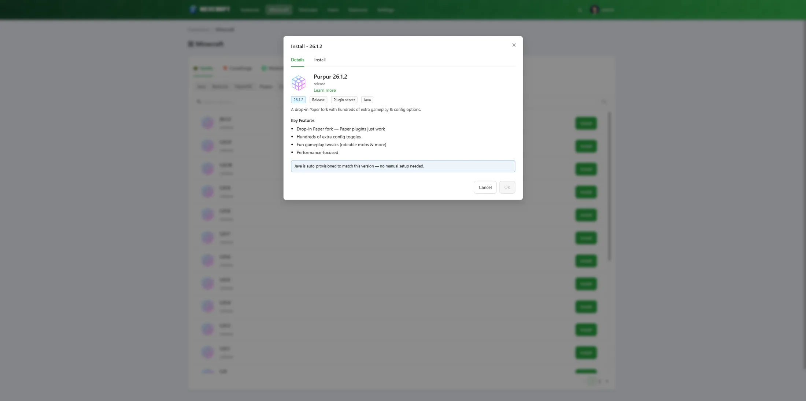
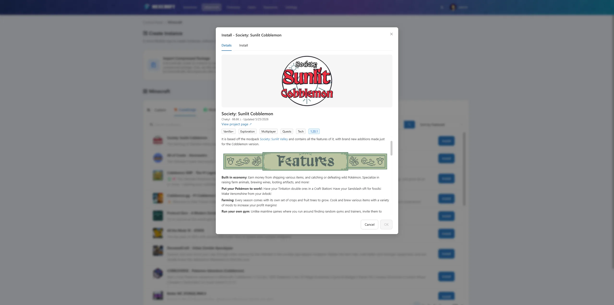
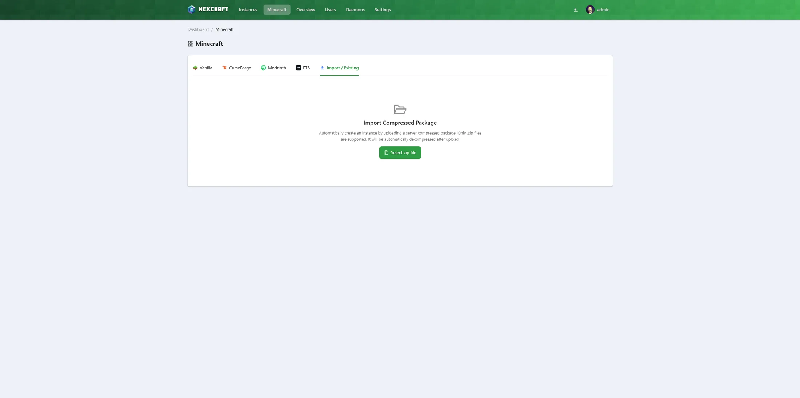

# Creating Minecraft Servers

NexCraft replaces the generic app marketplace with a **Prism-Launcher-style Minecraft builder**. Open the **Minecraft** menu (URL `/#/minecraft`) to get started. There are five sources to choose from:

- **Vanilla** — build a fresh server for any Minecraft version, with or without a mod loader.
- **CurseForge** — search and install CurseForge modpacks.
- **Modrinth** — search and install Modrinth modpacks.
- **FTB** — search and install Feed The Beast modpacks.
- **Import / Existing** — upload a server you already have and run it as-is (see [Importing an existing server](#importing-an-existing-server)).

## Vanilla (loaders / server software)

1. Select **Vanilla**.
2. Pick a **mod loader** from the row of icons:
   - **Vanilla** — the official Mojang server.
   - **Paper**, **Purpur**, **Folia** — high-performance server software (downloaded as a ready-to-run jar from their official APIs).
   - **Fabric**, **Forge**, **NeoForge**, **Quilt** — modloaders (the daemon runs the official installer/bootstrap).
3. Choose a **Minecraft version** from the list. Versions are pulled live — Mojang's manifest for Vanilla/loaders, and each project's API for Paper/Purpur/Folia. Tick **Show snapshots** to include non-release versions.
4. Click **Install**, set an **instance name** and **max memory**, and confirm.

The **Details** tab for each software shows its tags (version, release type, category), a curated **Key Features** list, and a note about the **Java version auto-provisioned** for it.

The daemon downloads the server, runs any loader bootstrap, assigns a free port, and writes the start command for you.

## CurseForge / Modrinth / FTB modpacks

1. Select **CurseForge**, **Modrinth**, or **FTB** and search (or browse the popular list).
2. Click a pack to open its detail dialog — description, tags, supported versions, and a **Version** picker.

   
3. Choose a version, accept the **Minecraft EULA**, set memory, and **Install**.

What happens under the hood:

- **CurseForge:** NexCraft installs the pack's **server pack** file. Packs without a server pack are shown disabled ("no server pack").
- **Modrinth:** NexCraft installs the full **`.mrpack`** server files (mods + overrides).
- **FTB:** NexCraft installs the server files listed in the pack's FTB manifest (server-side mods and configs, downloaded from the FTB CDN).
- The correct **mod loader and version** are resolved automatically from the pack metadata, and a matching **Java** version is provisioned if needed.
- Known **client-only mods** that crash dedicated servers (e.g. `e4mc` shipped in client optimization packs) are stripped automatically.
- A **server icon** is generated from the pack's logo, and the **EULA** is accepted on your behalf.

After install, NexCraft routes you to the instance's console to watch the bootstrap and start the server.

## Importing an existing server

Already have a server folder? Pick the **Import / Existing** source tab, upload it as a `.zip`, and NexCraft auto-detects what it is (Java vs Bedrock, loader, version) and walks you through a review screen before creating the instance. *(Admin only.)*

- **Java** — imported **as-is**: NexCraft runs the uploaded server with its existing world, mods, and configs.
- **Bedrock** — installs the **latest Bedrock Dedicated Server** and keeps your world (version-locked), with an *import-as-is* opt-out. The start command and file permissions are set for you.

## Starting the server

On the instance terminal, click **Start**. NexCraft shows **"Instance is starting…"** while the server boots and only flips to **Running** once the server actually reports it's ready — so the status reflects reality, not just that the process launched.

## Notes

- All servers run in **host / general process mode**. Running servers inside Docker containers is not supported in NexCraft.
- Ports are auto-assigned from 25565 upward so multiple servers don't collide. You can change them later in the server's `server.properties` (Config Files) or instance settings.
- The **start command** is generated for you but is editable under **Instance Settings → Startup Command** if you need to tweak it.
