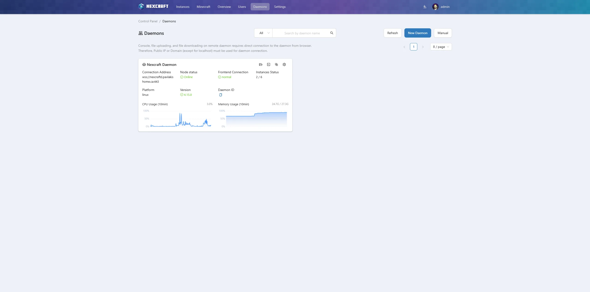

# Installation

NexCraft has two parts, the same as MCSManager:

- **Web** (`panel/` + `frontend/`) — the web UI and backend API (default port **23333**).
- **Daemon** (`daemon/`) — the agent that actually runs your servers on a node (default port **24444**).

You can run both on one machine or spread daemons across multiple machines and manage them all from one web panel.

> NexCraft is built and deployed **from source** (it's a personal fork). The recommended path is Docker images built from this repository.

## Requirements

- **Node.js** (latest LTS) — only needed if you build/run without Docker.
- Basic decompression utilities (the daemon unpacks server archives).
- The daemon image ships with **Java 21** and provisions additional JRE versions on demand for packs that need them (see [Java](managing-instances.md#java)).
- No database required.

## Build the Docker images

From the repository root:

```bash
# Daemon image — built from daemon/ + common/
docker build -f dockerfile/daemon.dockerfile -t nexcraft-daemon .

# Web image — built from frontend/ + panel/ + languages/
# (this build also compiles the daemon, since the panel bundles daemon source)
docker build -f dockerfile/web.dockerfile -t nexcraft-web .
```

## Run the containers

Run the daemon (mount persistent data/logs and, if you want Docker-related features, the Docker socket):

```bash
docker run -d --name nexcraft-daemon --restart unless-stopped \
  -p 24444:24444 \
  -e MCSM_DOCKER_WORKSPACE_PATH=/path/on/host/daemon/data/InstanceData \
  -v /path/on/host/daemon/data:/opt/mcsmanager/daemon/data \
  -v /path/on/host/daemon/logs:/opt/mcsmanager/daemon/logs \
  nexcraft-daemon
```

Run the web panel:

```bash
docker run -d --name nexcraft-web --restart unless-stopped \
  -p 23333:23333 \
  -v /path/on/host/web/data:/opt/mcsmanager/web/data \
  -v /path/on/host/web/logs:/opt/mcsmanager/web/logs \
  nexcraft-web
```

## First login & connecting a node

1. Open `http://<server-ip>:23333/` and complete first-time setup.
2. If the web panel doesn't auto-detect the local daemon, go to **Daemons** and add a node pointing at the daemon's IP and port (`24444`) with its access key.
3. Once the node shows **online**, you're ready to [create your first server](creating-servers.md).



## Updating

Pull the latest source, rebuild the image(s) that changed, and recreate the containers:

```bash
git pull
docker build -f dockerfile/web.dockerfile -t nexcraft-web .      # if web/panel/frontend/languages changed
docker build -f dockerfile/daemon.dockerfile -t nexcraft-daemon . # if daemon/common changed
# then recreate the affected container(s)
```

> The **web** build also compiles the daemon, so a daemon type error will fail the web build too. After a web rebuild, hard-refresh the browser (Ctrl+F5) to drop cached JS.
