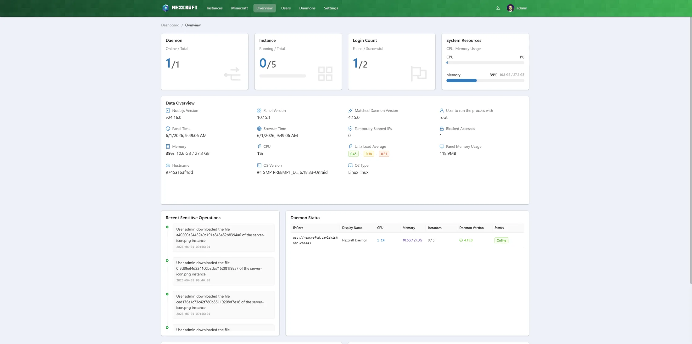
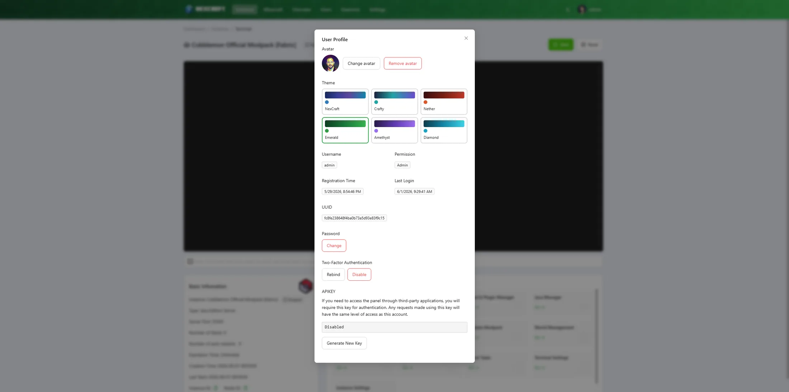

# Introduction

Welcome to the NexCraft docs. NexCraft is a self-hosted web panel for running **Minecraft** servers — search and install modpacks from **CurseForge**, **Modrinth** and **FTB**, build custom **Java** servers (Vanilla / Paper / Purpur / Folia / Fabric / Forge / NeoForge / Quilt), run **Bedrock** servers, and manage everything from one dashboard.

NexCraft supports both editions: alongside the Java builder and modpack installer, you can **import and run a Bedrock server** (it installs the latest Bedrock Dedicated Server and keeps your world, version-locked), with Bedrock-specific settings for server name, level and icon. The instances list badges each server by edition so the two are easy to tell apart.

> NexCraft is built on the open-source [MCSManager](https://github.com/MCSManager/MCSManager) panel. For a general-purpose, multi-game/commercial panel, see upstream MCSManager and its docs at <https://docs.mcsmanager.com/>.

## Contents

- **[Installation](installation.md)** — run the panel and connect a node.
- **[Creating Minecraft Servers](creating-servers.md)** — the Minecraft builder and modpack browser.
- **[Updating & Resetting Modpacks](modpacks.md)** — update a pack version or reinstall an instance.
- **[Managing an Instance](managing-instances.md)** — settings, MOTD, backups, players, metrics, Java.
- **[Troubleshooting / FAQ](faq.md)** — common issues and fixes.

## At a glance

| Area | What you get |
| --- | --- |
| **Modpack browser** | CurseForge / Modrinth / FTB / Custom, live search + version pickers, one-click install as a server |
| **Loaders** | Vanilla, Paper, Purpur, Folia, Fabric, Forge, NeoForge, Quilt — accurate versions from official APIs |
| **Bedrock** | Import & run Bedrock Dedicated Server (version-locked, world kept); Bedrock settings for server name / level / icon |
| **Import** | Bring an existing Java or Bedrock server in by uploading a `.zip` — auto-detected and reviewed before install |
| **Mods & plugins** | Per-instance manager — search Modrinth / CurseForge / SpigotMC, install, enable/disable, edit configs |
| **Update** | Bump an installed pack to a newer version; auto-backup, world preserved |
| **Reset / Reinstall** | Rebuild an instance with a choice of *auto-backup then wipe*, *full wipe*, or *preserve world* |
| **Java** | Auto-provisions a matching JRE (Adoptium / Azul Zulu) per pack |
| **Backups** | Manual + scheduled, with restore and exclusions |
| **Players** | RCON online list with op / kick / ban |
| **Metrics** | Per-instance CPU / RAM / players with zoom |
| **Ports** | Auto-assigns each instance its own free server port (Java + Bedrock) |
| **Convenience** | MOTD editor, server icon, autostart delay, shutdown timeout |

> **Note on Docker:** NexCraft runs servers in **host / general process mode** only — running game servers *inside* Docker containers (an MCSManager feature) has been removed from the UI to keep things simple and Minecraft-focused. The panel *itself* is typically deployed via Docker (see [Installation](installation.md)).

## Make it yours

Each user gets a profile with a custom **avatar** and a choice of six built-in colour **themes** (NexCraft, Crafty, Nether, Emerald, Amethyst, Diamond). Light and dark mode toggle independently, so your theme colour stays the same in either brightness.

