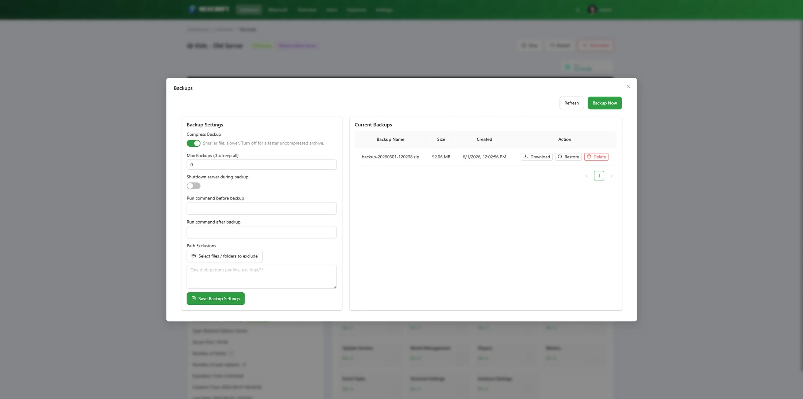

# Managing an Instance

Each instance has a **Manage Instance** grid (full-page features) and an **Instance Settings** dialog (form-style settings). This page covers the NexCraft-specific bits.

## Instance Settings

Open **Instance Settings** from the manage grid. The **Basic** tab holds the everyday settings; **Advanced** holds working directory, update command, file encoding, and run-as user.

For Minecraft Java instances, the Basic tab also includes:

### Server MOTD
An easy single-field editor that writes the `motd` line in `server.properties`. Supports `&` colour codes (e.g. `&6Gold &lBold`) and a second line. Applies on the next start.

### Server Icon
Upload an image — it's resized to 64×64 and saved as `server-icon.png` for the server list. (Moved here from the manage grid to keep things tidy.)

### Shutdown Timeout
Seconds to wait after the stop command before NexCraft force-kills the process. `0` = wait indefinitely.

### Startup / Stop Command
The generated start command is editable here; the stop command defaults to `stop` for Minecraft.

## Event Tasks (auto start / restart)

In **Event Tasks** you can enable:

- **Auto Restart** — restart the instance immediately if it stops unexpectedly (optionally capped to N times).
- **Auto Start** — start the instance when the daemon boots, with a configurable **Autostart Delay** (seconds) so multiple servers don't all spin up at once.

## Backups

The **Backups** card supports:

- **Manual** backups and **scheduled** backups (cron-style).
- **Restore** any backup (uses an overwrite-safe extractor so it fully replaces the live files).
- **Compression** toggle, **max backups** retention, **stop-during-backup**, **pre/post commands**, and **file-tree exclusions**.
- **Download** / **delete** individual backups.

Backups are stored outside the instance folder, so resets/wipes never touch them.

## Players (RCON)

The **Players** card uses RCON to show who's online (with skin heads) and lets you **Op / Deop / Kick / Ban / Unban**. NexCraft auto-enables RCON with a random password and a free port when it sets up a server, so this usually works out of the box.

## Metrics

The **Metrics** card charts per-instance **CPU %**, **RAM (GB)**, and **player count** over time, with selectable ranges (1 min → 24 h), shift-wheel zoom and drag-to-zoom. CPU/RAM are measured across the server's **process tree** (not a container), so they're accurate in host/general mode. The player count refreshes about every 10 seconds.

## Java

NexCraft auto-provisions a matching **JRE** for packs that need one — so an old pack (Java 8/17) or a brand-new one (Java 21/25) just works.

- The daemon ships **Java 21** and downloads other versions on demand.
- The **Java Manager** dialog lets you browse and install specific versions: pick a **vendor** (Adoptium / Azul Zulu), a **major** version, then a specific **release** (with release dates), and click **Use** to bind it to the instance.
- Installed Javas are referenced via the `{mcsm_java}` token in the start command.

See [Troubleshooting](faq.md) if a server fails to start with a Java version error.
