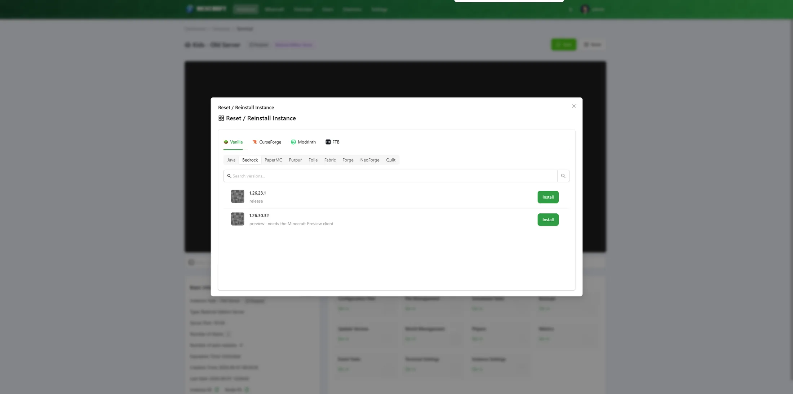

# Updating & Resetting Modpacks

Once an instance is installed from a modpack (or built from the Custom builder), NexCraft remembers what it is, so you can update or rebuild it later without re-finding the pack.

## Updating a modpack to a newer version

Use the **Update Modpack** card on a modpack instance (it appears in the manage grid only for instances installed from CurseForge/Modrinth/FTB, and is admin-only).

1. Open **Update Modpack**. It shows the current pack — icon, name, loader, MC version, installed version and date.
2. Pick a newer version from the **Version** dropdown (the current one is marked).
3. Click **Update** and confirm.

What it does:

- **Automatically takes a full backup first**, then stops the server.
- Replaces mods / config / loader files with the new version.
- **Preserves your world**, `server.properties`, `ops.json`, `whitelist.json`, banned lists, `usercache.json`, `eula.txt`, and `server-icon.png`.
- Re-bootstraps the loader for the new version and restarts the server if it was running.

If the update fails, the server is left stopped (the pre-update backup is your recovery path) rather than booting a half-updated world.

## Reset / Reinstall an instance

The **Reset** button (on the instance terminal) rebuilds an instance using the same Minecraft builder. For a **modpack** or **Bedrock** instance it opens **straight to a focused, version-locked reset popup**; for a custom/vanilla Java instance it opens the builder so you can pick a version.

For a **Bedrock** server the reset is locked to the installed Bedrock version — it opens directly on that version's popup (no version browsing), so you just choose what to do with existing files and confirm:

You choose **what to do with existing files**:

| Mode | What happens |
| --- | --- |
| **Auto-backup, then wipe** *(recommended)* | A full backup is taken, then the instance folder is wiped and the pack is installed fresh. |
| **Full wipe, no backup** | The instance is wiped completely and reinstalled, with **no** backup. Fastest, but the current world and configs are gone. |
| **Preserve world, replace the rest** | Keeps the world, `server.properties`, ops/whitelist and icon; replaces mods, config and loader files. |

Notes:

- Backups live **outside** the instance folder, so a full wipe never deletes them.
- The EULA is pre-ticked on a reset (the instance already existed).
- A reset can switch the instance to a *different* pack/loader too — just browse to another one in the same dialog.

> **Tip:** "Update" is for staying on the same pack and bumping its version (world-safe by default). "Reset" is for a clean rebuild or switching packs.
